# DBS zadania

pre orm bol použitý django orm spojení s sqlalchemy. Prepojenie je robené pomocou knižnice aldjemy.

## Zadanie 3 v2/...

### v2/patches/

```sql
SELECT 
    name as patch_version,
    patch_start_date,
    patch_end_date,
    matches.id as match_id,
    ROUND((matches.duration::numeric / 60),2) as match_duration
    FROM (
        SELECT name,
        cast(extract(epoch from release_date) as integer) as patch_start_date,
        cast(extract(epoch from LEAD(release_date,1) OVER (ORDER BY name)) as integer) as patch_end_date
        FROM patches
    ) as myquery 
    LEFT JOIN matches ON matches.start_time BETWEEN patch_start_date AND patch_end_date
    ORDER BY name;
```

**v4/patches/**:

```sql
EXPLAIN ANALYZE
SELECT anon_1.name, anon_1.release_date, 
        anon_1.end_date, anon_2.id, anon_2.duration_minutes 
FROM (SELECT patches.name AS name, 
      CAST(EXTRACT(EPOCH FROM patches.release_date) AS INTEGER) AS release_date,
      lead(CAST(EXTRACT(EPOCH FROM patches.release_date) AS INTEGER), 1) OVER (ORDER BY patches.name) AS end_date        
        FROM patches) AS anon_1 
LEFT OUTER JOIN (SELECT matches.id AS id, matches.start_time AS start_time,
                 round(CAST(matches.duration AS NUMERIC(10, 2)) / 60, 2) AS duration_minutes
                FROM matches) AS anon_2 
    ON anon_2.start_time >= anon_1.release_date AND anon_2.start_time <= anon_1.end_date
ORDER BY anon_1.name
```

Hlavnými rozdielmi medzi našim a generovaným dopytom je použitie subquery v LEFT JOIN funkcií ako aj použitie LEFT OUTER JOIN namiesto nášho LEFT JOIN. Ďalšou zmenou je poradie použití funkcií LEAD a CAST. V našom query najprv nájdeme ďalší riadok pomocou LEAD a potom ho premeníme na INT pomocou CAST. Generovaná query to robí naopak.

EXPLAIN ANALYZE: 

| v2                                                                                                                                                                                                                 | v4                                                                                                                                                                                                                 |
| ------------------------------------------------------------------------------------------------------------------------------------------------------------------------------------------------------------------ | ------------------------------------------------------------------------------------------------------------------------------------------------------------------------------------------------------------------ |
| Nested Loop Left Join  (cost=1.59..18559.98 rows=105556 width=76)   (actual time=1984.559..19283.147 rows=50005 loops=1)                                                                                           | Nested Loop Left Join    (cost=1.59..18823.87 rows=105556 width=76) (actual   time=1911.239..20234.112 rows=50005 loops=1)                                                                                         |
| Join Filter: ((matches.start_time >= ((date_part('epoch'::text,   patches.release_date))::integer)) AND (matches.start_time <=   ((date_part('epoch'::text, lead(patches.release_date, 1) OVER   (?)))::integer))) | Join Filter: ((matches.start_time   >= ((date_part('epoch'::text, patches.release_date))::integer)) AND   (matches.start_time <= (lead((date_part('epoch'::text,   patches.release_date))::integer, 1) OVER (?)))) |
| Rows Removed by Join Filter: 900000                                                                                                                                                                                | Rows Removed by Join Filter:   900000                                                                                                                                                                              |
| ->  WindowAgg  (cost=1.59..2.12 rows=19 width=40) (actual   time=1.386..2.252 rows=19 loops=1)                                                                                                                     | ->  WindowAgg    (cost=1.59..2.12 rows=19 width=40) (actual time=0.642..1.535 rows=19   loops=1)                                                                                                                   |
| ->  Sort  (cost=1.59..1.64 rows=19 width=40) (actual   time=0.986..1.203 rows=19 loops=1)                                                                                                                          | ->  Sort    (cost=1.59..1.64 rows=19 width=40) (actual time=0.443..0.651 rows=19   loops=1)                                                                                                                        |
| Sort Key: patches.name                                                                                                                                                                                             | Sort Key:   patches.name                                                                                                                                                                                           |
| Sort Method: quicksort  Memory: 25kB                                                                                                                                                                               | Sort Method:   quicksort  Memory: 25kB                                                                                                                                                                             |
| ->  Seq Scan on patches  (cost=0.00..1.19 rows=19 width=40) (actual   time=0.072..0.502 rows=19 loops=1)                                                                                                           | ->  Seq Scan on patches  (cost=0.00..1.19 rows=19 width=40) (actual   time=0.020..0.208 rows=19 loops=1)                                                                                                           |
| ->  Materialize  (cost=0.00..1266.00 rows=50000 width=12)   (actual time=0.014..516.631 rows=50000 loops=19)                                                                                                       | ->  Materialize    (cost=0.00..1266.00 rows=50000 width=12) (actual time=0.012..539.665   rows=50000 loops=19)                                                                                                     |
| ->  Seq Scan on matches  (cost=0.00..1016.00 rows=50000 width=12)   (actual time=0.036..504.491 rows=50000 loops=1)                                                                                                | ->  Seq Scan on matches  (cost=0.00..1016.00 rows=50000 width=12)   (actual time=0.030..483.665 rows=50000 loops=1)                                                                                                |
| Planning Time: 0.592 ms                                                                                                                                                                                            | Planning Time: 0.532 ms                                                                                                                                                                                            |
| Execution Time: 19752.632 ms                                                                                                                                                                                       | Execution Time: 20742.658 ms                                                                                                                                                                                       |

Všetky riadky tvoria totožné operácie. Jediný krát kedy sa mení cost operácie je hneď v prvej operácií (Nested Loop Left Join) kedy total cost je v našom menší ako ~260. Väčšina operácií vykonaných v orm dotaze má menší actual_time ako pri našej. Jedinými výnimkami sú "Nested Loop Left Join" a "Materialize", kde náš dotaz má menší celkový čas. Rows sú v každej operácií rovnaké. Celkovo plánovanie dotazu bolo porovnateľne rovnaké. Na druhú stranu, čas vykonávania bol pre náš dotaz rýchlejší o ~1000 ms.


Celkovo Query vyzerajú rovnako, až na poradie niektorých sql funkcií, čo potvrdil aj rovnaký výstup z explain analyze.


Náš:

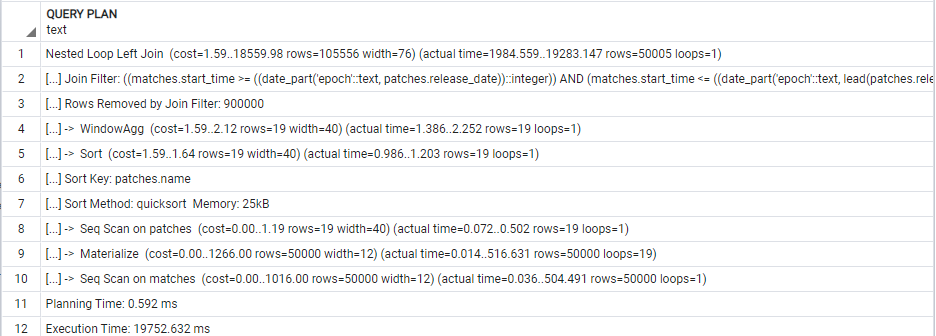

ORM:


### v2/players/{id}/game_exp/

```sql
SELECT players.id,COALESCE(nick,'unknown') as player_nick,
    localized_name as hero_localized_name,
    ROUND((matches.duration::numeric / 60),2) as match_duration_minutes,
    COALESCE(xp_hero,0) + COALESCE(xp_creep,0)+ COALESCE(xp_other,0) + COALESCE(xp_roshan,0) as experiences_gained,
    level as level_gained,
    matches.radiant_win = (player_slot BETWEEN 0 and 4) as winner,
    match_id
    FROM players
    INNER JOIN matches_players_details ON players.id = player_id 
    INNER JOIN heroes ON heroes.id = hero_id
    INNER JOIN matches ON match_id = matches.id
    WHERE players.id = {id}
    ORDER BY match_id;
```

**v4/players/{id}/game_exp/**:

```sql
SELECT    players.id,
        coalesce(players.nick, 'unknown') AS coalesce_1,
        heroes.localized_name, round(CAST(matches.duration AS NUMERIC(10, 2)) /  60, 2) AS duration_minutes,
        coalesce(matches_players_details.xp_hero, 0)+ 
        coalesce(matches_players_details.xp_creep,0) + 
        coalesce(matches_players_details.xp_other, 0) + 
        coalesce(matches_players_details.xp_roshan, 0) AS anon_1,
        matches_players_details.level, 
        matches.radiant_win = (matches_players_details.player_slot >= 0 AND matches_players_details.player_slot <= 4) AS anon_2,
        matches.id AS id_1
FROM players 
JOIN matches_players_details ON players.id = matches_players_details.player_id 
JOIN matches ON matches.id = matches_players_details.match_id 
JOIN heroes ON heroes.id = matches_players_details.hero_id
WHERE players.id = {id}
ORDER BY matches.id
```

Naša a generovaná query sú skoro rovnaké. Jediným rozdielom je použitie JOINOV. Kde my používame INNER JOIN, generovaná používa iba JOIN; Kde máme LEFT JOIN je použitý LEFT OUTER JOIN. Ďalej my na zoraďovanie používame matches_players_details.match_id. Generovaná používa matches.id. Ďalším rozdielom je, že sme pre pole winner použili BETWEEN a generovaná vypísala hranice pomocou >= a <=.

EXPLAIN ANALYZE: 

| v2                                                                                                                                       | v4                                                                                                                                       |
| ---------------------------------------------------------------------------------------------------------------------------------------- | ---------------------------------------------------------------------------------------------------------------------------------------- |
| Gather Merge  (cost=14228.08..14229.14 rows=9 width=91)   (actual time=29.718..32.487 rows=13 loops=1)                                   | Gather Merge    (cost=14228.08..14229.15 rows=9 width=91) (actual time=27.951..31.247   rows=13 loops=1)                                 |
| Workers Planned: 3                                                                                                                       | Workers Planned: 3                                                                                                                       |
| Workers Launched: 3                                                                                                                      | Workers Launched: 3                                                                                                                      |
| ->  Sort  (cost=13228.04..13228.04 rows=3 width=91)   (actual time=24.566..24.613 rows=3 loops=4)                                        | ->  Sort    (cost=13228.04..13228.05 rows=3 width=91) (actual time=22.615..22.662   rows=3 loops=4)                                      |
| Sort Key: matches_players_details.match_id                                                                                               | Sort Key: matches.id                                                                                                                     |
| Sort Method: quicksort  Memory:   25kB                                                                                                   | Sort Method: quicksort  Memory: 25kB                                                                                                     |
| Worker 0:  Sort Method:   quicksort  Memory: 25kB                                                                                        | Worker 0:  Sort Method: quicksort  Memory: 25kB                                                                                          |
| Worker 1:  Sort Method:   quicksort  Memory: 25kB                                                                                        | Worker 1:  Sort Method: quicksort  Memory: 25kB                                                                                          |
| Worker 2:  Sort Method:   quicksort  Memory: 25kB                                                                                        | Worker 2:  Sort Method: quicksort  Memory: 25kB                                                                                          |
| ->  Nested Loop  (cost=4.25..13228.01 rows=3 width=91)   (actual time=11.894..24.470 rows=3 loops=4)                                     | ->  Hash Join    (cost=4.25..13228.02 rows=3 width=91) (actual time=9.890..22.510   rows=3 loops=4)                                      |
| ->  Hash Join    (cost=3.96..13203.02 rows=3 width=53) (actual time=11.779..24.184   rows=3 loops=4)                                     | Hash Cond:   (matches_players_details.hero_id = heroes.id)                                                                               |
| Hash Cond:   (matches_players_details.hero_id = heroes.id)                                                                               | ->  Nested Loop    (cost=0.71..13224.39 rows=3 width=52) (actual time=7.060..19.600   rows=3 loops=4)                                    |
| ->  Nested Loop    (cost=0.42..13199.47 rows=3 width=47) (actual time=8.752..21.083   rows=3 loops=4)                                    | ->  Nested Loop    (cost=0.42..13199.47 rows=3 width=47) (actual time=6.983..19.357   rows=3 loops=4)                                    |
| ->  Parallel Seq Scan on   matches_players_details    (cost=0.00..13174.13 rows=3 width=36) (actual time=8.681..20.783   rows=3 loops=4) | ->  Parallel Seq Scan on   matches_players_details    (cost=0.00..13174.13 rows=3 width=36) (actual time=6.896..18.874   rows=3 loops=4) |
| Filter:   (player_id = 14944)                                                                                                            | Filter: (player_id = 14944)                                                                                                              |
| Rows Removed   by Filter: 124997                                                                                                         | Rows Removed by Filter: 124997                                                                                                           |
| ->  Index Scan using players_pk on players  (cost=0.42..8.44 rows=1 width=15) (actual   time=0.022..0.037 rows=1 loops=13)               | ->  Index Scan using   players_pk on players  (cost=0.42..8.44   rows=1 width=15) (actual time=0.073..0.088 rows=1 loops=13)             |
| Index Cond:   (id = 14944)                                                                                                               | Index Cond: (id = 14944)                                                                                                                 |
| ->  Hash    (cost=2.13..2.13 rows=113 width=14) (actual time=2.844..2.855 rows=113   loops=4)                                            | ->  Index Scan using matches_pk on matches  (cost=0.29..8.31 rows=1 width=9) (actual   time=0.030..0.034 rows=1 loops=13)                |
| Buckets: 1024  Batches: 1    Memory Usage: 14kB                                                                                          | Index   Cond: (id = matches_players_details.match_id)                                                                                    |
| ->  Seq Scan on heroes  (cost=0.00..2.13 rows=113 width=14) (actual   time=0.050..1.405 rows=113 loops=4)                                | ->  Hash    (cost=2.13..2.13 rows=113 width=14) (actual time=2.628..2.639 rows=113   loops=4)                                            |
| ->  Index Scan using matches_pk on matches  (cost=0.29..8.31 rows=1 width=9) (actual   time=0.033..0.036 rows=1 loops=13)                | Buckets:   1024  Batches: 1  Memory Usage: 14kB                                                                                          |
| Index Cond: (id =   matches_players_details.match_id)                                                                                    | ->  Seq Scan on heroes  (cost=0.00..2.13 rows=113 width=14) (actual   time=0.052..1.322 rows=113 loops=4)                                |
| Planning Time: 0.494 ms                                                                                                                  | Planning Time: 0.628 ms                                                                                                                  |
| Execution Time: 33.079 ms                                                                                                                | Execution Time: 31.761 ms                                                                                                                |

V prvom kroku ako aj v riadku 4 sa total cost pre v4 zvyšil  o 0.01. Po spustení workerov sa v našom query spustil Nested Loop  a po ňom hash join.  V generovanom sa spustil až po vykonaní hash joinu a mal výrazne menší start up cost ako pri našom, ale o trochu menší total cost. Náš Hash join mal nepatrne menší cost ako keď sa vykonával prvý v orm dotaze. Celkovo cost je cost pre kombinacie týchto dvoch riadkov lepší pri ORM dotaze. Podobné preusporiadanie nastalo aj neskôr v našom dotaze sa spustilo Hash -> Seq Scan -> Index Scan a v generovanom: Index Scan -> Hash -> Seq Scan. Napriek tomuto rovnaké operácie mali stále rovnaké hodnoty cost aj rows. A preusporiadanie v ORM dotaze bolo časovo efektívnejšie. Celkový čas vykonávania bol rýchlejší pre ORM dotaz a to približne o 2,5 ms a plánovanie dotazov sa líšilo iba o ~0.1 ms. 

Celkovo sa query od seba moc výzorovo moc nelíšia, ale generujú rôzne EXPLAIN ANALYZE, hlavne čo sa týka preusporiadania operácií. Generovaný dotaz sa ukázal ako efektívnejší aj keď nie o moc.

Náš:

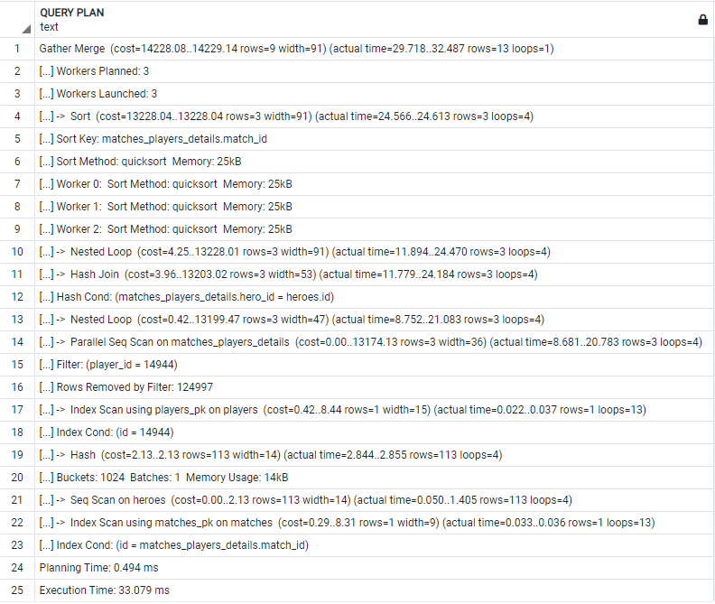

ORM:

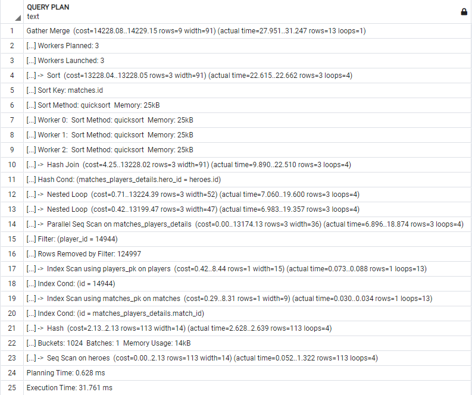

### v2/players/{id}/game_objectives/

```sql
SELECT players.id,COALESCE(nick,'unknown') as player_nick,localized_name as hero_localized_name,
    match_id,COALESCE(subtype,'NO_ACTION') as hero_action, COUNT(COALESCE(subtype,'NO_ACTION')) as count
    FROM players
    INNER JOIN matches_players_details ON players.id = player_id
    INNER JOIN heroes ON heroes.id = hero_id
    INNER JOIN matches ON matches.id = match_id
    LEFT JOIN game_objectives ON match_player_detail_id_1 = matches_players_details.id
    WHERE players.id =  {id}
    GROUP BY  players.id,COALESCE(nick,'unknown'),localized_name,
    match_id,subtype
    ORDER BY match_id,localized_name;
```

**v4/players/{id}/game_objectives/**:

```sql
SELECT     players.id,
        coalesce(players.nick, 'unknown') AS coalesce_1,
        heroes.localized_name, matches.id AS id_1,
        coalesce(game_objectives.subtype, 'NO_ACTION') AS coalesce_3,
        count(coalesce(game_objectives.subtype, 'NO_ACTION')) AS count_1
FROM players 
JOIN matches_players_details ON players.id = matches_players_details.player_id
JOIN matches ON matches.id = matches_players_details.match_id
JOIN heroes ON heroes.id = matches_players_details.hero_id
LEFT OUTER JOIN game_objectives ON game_objectives.match_player_detail_id_1 = matches_players_details.id
WHERE players.id = 14944
GROUP BY players.id, coalesce(players.nick, 'unknown'), heroes.localized_name, matches.id, game_objectives.subtype
ORDER BY matches.id, heroes.localized_namelized_name
```

Naša a generovaná query sú skoro rovnaké. Jediným rozdielom je použitie JOINOV. Kde my používame INNER JOIN, generovaná používa iba JOIN; Kde máme LEFT JOIN je použitý LEFT OUTER JOIN. Ďalej my na zoraďovanie používame matches_players_details.match_id. Generovaná používa matches.id. 

EXPLAIN ANALYZE: 

| v2                                                                                                                                                     | v4                                                                                                                                         |
| ------------------------------------------------------------------------------------------------------------------------------------------------------ | ------------------------------------------------------------------------------------------------------------------------------------------ |
| GroupAggregate  (cost=34801.70..34802.33 rows=23 width=114)   (actual time=6923.820..6924.428 rows=16 loops=1)                                         | GroupAggregate    (cost=34801.70..34802.33 rows=23 width=114) (actual   time=6152.027..6152.568 rows=16 loops=1)                           |
| Group Key: matches_players_details.match_id, heroes.localized_name,   players.id, (COALESCE(players.nick, 'unknown'::text)),   game_objectives.subtype | Group Key: matches.id,   heroes.localized_name, players.id, (COALESCE(players.nick, 'unknown'::text)),   game_objectives.subtype           |
| ->  Sort  (cost=34801.70..34801.76 rows=23 width=74)   (actual time=6923.758..6923.968 rows=18 loops=1)                                                | ->  Sort    (cost=34801.70..34801.76 rows=23 width=74) (actual   time=6151.975..6152.155 rows=18 loops=1)                                  |
| Sort Key: matches_players_details.match_id, heroes.localized_name,   (COALESCE(players.nick, 'unknown'::text)), game_objectives.subtype                | Sort Key: matches.id,   heroes.localized_name, (COALESCE(players.nick, 'unknown'::text)),   game_objectives.subtype                        |
| Sort Method: quicksort  Memory:   26kB                                                                                                                 | Sort Method: quicksort  Memory: 26kB                                                                                                       |
| ->  Nested Loop  (cost=21591.84..34801.18 rows=23 width=74)   (actual time=6904.133..6923.437 rows=18 loops=1)                                         | ->  Nested Loop    (cost=21591.84..34801.18 rows=23 width=74) (actual   time=6139.631..6151.772 rows=18 loops=1)                           |
| ->  Index Scan using players_pk on players  (cost=0.42..8.44 rows=1 width=15) (actual   time=0.027..0.051 rows=1 loops=1)                              | ->  Index Scan using players_pk on players  (cost=0.42..8.44 rows=1 width=15) (actual   time=0.020..0.046 rows=1 loops=1)                  |
| Index Cond: (id = 14944)                                                                                                                               | Index Cond: (id   = 14944)                                                                                                                 |
| ->  Gather    (cost=21591.42..34792.51 rows=23 width=42) (actual   time=6904.055..6924.654 rows=18 loops=1)                                            | ->  Gather    (cost=21591.42..34792.51 rows=23 width=42) (actual   time=6139.580..6153.321 rows=18 loops=1)                                |
| Workers Planned: 3                                                                                                                                     | Workers   Planned: 3                                                                                                                       |
| Workers Launched: 3                                                                                                                                    | Workers   Launched: 3                                                                                                                      |
| ->  Parallel Hash Left Join  (cost=20591.42..33790.21 rows=7 width=42)   (actual time=6903.686..6916.146 rows=4 loops=4)                               | ->  Parallel Hash Left Join  (cost=20591.42..33790.21 rows=7 width=42)   (actual time=6135.451..6145.608 rows=4 loops=4)                   |
| Hash Cond:   (matches_players_details.id = game_objectives.match_player_detail_id_1)                                                                   | Hash   Cond: (matches_players_details.id = game_objectives.match_player_detail_id_1)                                                       |
| ->  Nested Loop    (cost=3.83..13202.60 rows=3 width=22) (actual time=8.413..20.375   rows=3 loops=4)                                                  | ->  Hash Join  (cost=3.83..13202.60 rows=3 width=22)   (actual time=8.661..18.357 rows=3 loops=4)                                          |
| ->  Hash Join    (cost=3.54..13177.68 rows=3 width=22) (actual time=8.299..20.075   rows=3 loops=4)                                                    | Hash Cond: (matches_players_details.hero_id = heroes.id)                                                                                   |
| Hash   Cond: (matches_players_details.hero_id = heroes.id)                                                                                             | ->  Nested Loop  (cost=0.29..13199.05 rows=3 width=16)   (actual time=6.270..15.899 rows=3 loops=4)                                        |
| ->  Parallel Seq Scan on   matches_players_details    (cost=0.00..13174.13 rows=3 width=16) (actual time=5.436..17.127   rows=3 loops=4)               | ->  Parallel Seq Scan on   matches_players_details    (cost=0.00..13174.13 rows=3 width=16) (actual time=6.140..15.588   rows=3 loops=4)   |
| Filter: (player_id = 14944)                                                                                                                            | Filter: (player_id = 14944)                                                                                                                |
| Rows Removed by Filter: 124997                                                                                                                         | Rows Removed by Filter: 124997                                                                                                             |
| ->  Hash  (cost=2.13..2.13 rows=113 width=14) (actual   time=2.772..2.781 rows=113 loops=4)                                                            | ->  Index Only Scan using   matches_pk on matches  (cost=0.29..8.31   rows=1 width=4) (actual time=0.047..0.051 rows=1 loops=13)           |
| Buckets: 1024  Batches: 1  Memory Usage: 14kB                                                                                                          | Index Cond: (id = matches_players_details.match_id)                                                                                        |
| ->  Seq Scan on heroes  (cost=0.00..2.13 rows=113 width=14) (actual   time=0.068..1.358 rows=113 loops=4)                                              | Heap Fetches: 13                                                                                                                           |
| ->  Index Only Scan using matches_pk on   matches  (cost=0.29..8.31 rows=1   width=4) (actual time=0.045..0.048 rows=1 loops=13)                       | ->  Hash  (cost=2.13..2.13 rows=113 width=14) (actual   time=2.310..2.320 rows=113 loops=4)                                                |
| Index   Cond: (id = matches_players_details.match_id)                                                                                                  | Buckets: 1024  Batches: 1  Memory Usage: 14kB                                                                                              |
| Heap   Fetches: 13                                                                                                                                     | ->  Seq Scan on heroes  (cost=0.00..2.13 rows=113 width=14) (actual   time=0.042..1.166 rows=113 loops=4)                                  |
| ->  Parallel Hash  (cost=15856.15..15856.15 rows=378515   width=28) (actual time=6892.286..6892.296 rows=293349 loops=4)                               | ->  Parallel Hash  (cost=15856.15..15856.15 rows=378515   width=28) (actual time=6124.304..6124.313 rows=293349 loops=4)                   |
| Buckets:   2097152  Batches: 1  Memory Usage: 60736kB                                                                                                  | Buckets: 2097152  Batches:   1  Memory Usage: 60704kB                                                                                      |
| ->  Parallel Seq Scan on game_objectives  (cost=0.00..15856.15 rows=378515 width=28)   (actual time=0.038..3445.872 rows=293349 loops=4)               | ->  Parallel Seq Scan on   game_objectives  (cost=0.00..15856.15   rows=378515 width=28) (actual time=0.030..3053.512 rows=293349 loops=4) |
| Planning Time: 1.193 ms                                                                                                                                | Planning Time: 0.798 ms                                                                                                                    |
| Execution Time: 6926.911 ms                                                                                                                            | Execution Time: 6155.099 ms                                                                                                                |

Plán query sa nelíšia od seba do riadku 13, pričom generovaná query mala skutočný čas rýchlejší ako naša. Po riadku 13 sa v plánoch prehodili riadky HASH JOIN a NESTED LOOP. Náš Nested Loop mal väčší cost ako ten vo v4, ale rovnaký ako HASH JOIN v rovnakom riadku Na druhú stranu HASH JOIN v našom dopyte mal potom stále cost 3.54..13177.68, kde NESTED LOOP pre v4 mal iba cost 0.29..13199.05. Celkový čas pre tieto operácie bol menší pre náš dotaz. Parallel Seq mali všetky hodnoty rovnaké, až na čas, kde sa ukázala naša query rýchlejšia. Následne zase boli poprehadzované plánovača v našej idú: HASH ->Seq Scan -> Index Only Scan a vo v4: Index Only Scan -> Hash -> Seq Scan. Na druhú stranu je ich vykonanie porovnateľne rovnaké a všetky operácie majú rovnaké cost hodnoty a časovo sa líšia minimálne. Posledné kroky sú si podobne (rovnaké hodnoty cost, rows, loops) s tým, že v4 je rýchlejšie. Teda čas plánovania vykonania našej a generovanej query je podobné. Rows sú vo všetkých riadkoch rovnaké.
Celkovo sú query rovnaké až na malé rozdiely a moc sa nerozlišujú ani časovo, ale generovaná v4 je rýchlejšia.

Náš:

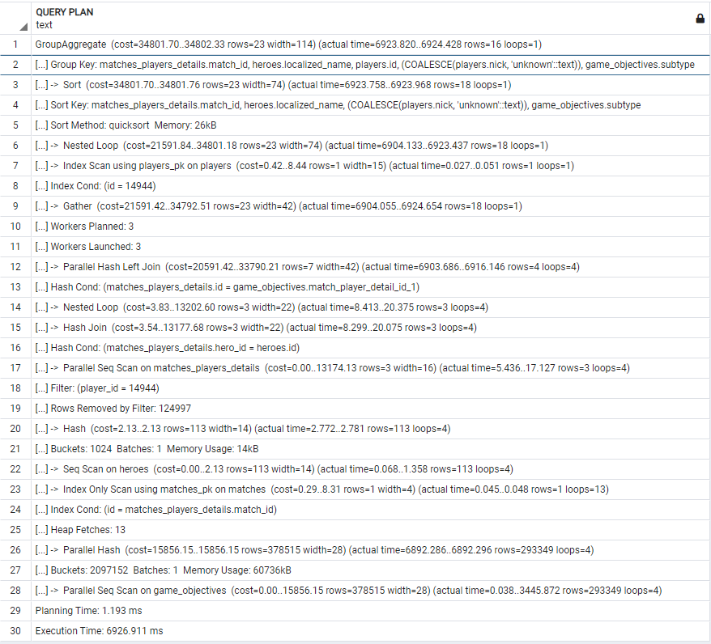

ORM:

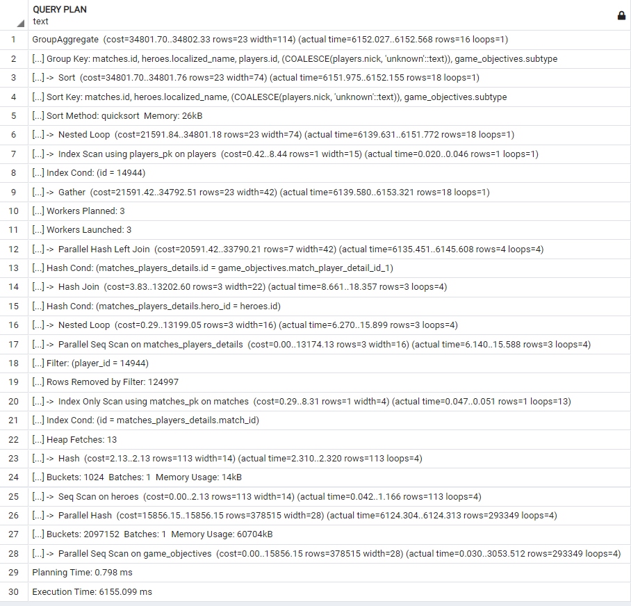

### v2/players/{id}/abilities/

```sql
SELECT players.id, 
COALESCE(nick,'unknown') as player_nick,
localized_name as hero_localized_name,
match_id, abilities.name as ability_name,
COUNT(*) as count,
MAX(ability_upgrades.level) as upgrade_level
FROM players
INNER JOIN matches_players_details ON player_id = players.id
INNER JOIN matches ON match_id = matches.id
INNER JOIN heroes ON hero_id = heroes.id
INNER JOIN ability_upgrades ON match_player_detail_id = matches_players_details.id
INNER JOIN abilities ON abilities.id = ability_id
WHERE player_id = {id}
GROUP BY players.id, COALESCE(nick,'unknown'),localized_name,match_id, abilities.name
ORDER BY match_id, abilities.name
```

**v4/players/{id}/abilities/**:

```sql
SELECT     players.id, coalesce(players.nick, 'unknown') AS coalesce_1,
        heroes.localized_name, matches.id AS id_1, abilities.name, 
        count('*') AS count_1, max(ability_upgrades.level) AS max_1
FROM players 
JOIN matches_players_details ON players.id = matches_players_details.player_id
JOIN matches ON matches.id = matches_players_details.match_id
JOIN heroes ON heroes.id = matches_players_details.hero_id
JOIN ability_upgrades ON matches_players_details.id = ability_upgrades.match_player_detail_id
JOIN abilities ON abilities.id = ability_upgrades.ability_id
WHERE players.id = {id}
GROUP BY players.id, coalesce(players.nick, 'unknown'), heroes.localized_name, matches.id, abilities.name
ORDER BY matches.id, abilities.name
```

Naša a generovaná query sú skoro rovnaké. Jediným rozdielom je použitie JOINOV. Kde my používame INNER JOIN, generovaná používa iba JOIN; Kde máme LEFT JOIN je použitý LEFT OUTER JOIN. Ďalej my na zoraďovanie používame matches_players_details.match_id. Generovaná používa matches.id.

EXPLAIN ANALYZE: 

| v2                                                                                                                                             | v4                                                                                                                                             |
| ---------------------------------------------------------------------------------------------------------------------------------------------- | ---------------------------------------------------------------------------------------------------------------------------------------------- |
| GroupAggregate  (cost=99756.31..99761.68 rows=179 width=84)   (actual time=49994.561..50003.489 rows=63 loops=1)                               | GroupAggregate    (cost=99756.31..99761.68 rows=179 width=84) (actual   time=48985.646..48991.218 rows=63 loops=1)                             |
| Group Key: matches_players_details.match_id, abilities.name,   players.id, (COALESCE(players.nick, 'unknown'::text)), heroes.localized_name    | Group Key: matches.id,   abilities.name, players.id, (COALESCE(players.nick, 'unknown'::text)),   heroes.localized_name                        |
| ->  Sort  (cost=99756.31..99756.76 rows=179 width=76)   (actual time=49994.452..49998.324 rows=239 loops=1)                                    | ->  Sort    (cost=99756.31..99756.76 rows=179 width=76) (actual   time=48985.575..48987.968 rows=239 loops=1)                                  |
| Sort Key: matches_players_details.match_id, abilities.name,   (COALESCE(players.nick, 'unknown'::text)), heroes.localized_name                 | Sort Key: matches.id,   abilities.name, (COALESCE(players.nick, 'unknown'::text)),   heroes.localized_name                                     |
| Sort Method: quicksort  Memory:   49kB                                                                                                         | Sort Method: quicksort  Memory: 49kB                                                                                                           |
| ->  Nested Loop  (cost=14178.69..99749.61 rows=179 width=76)   (actual time=15340.309..49990.507 rows=239 loops=1)                             | ->  Nested Loop    (cost=14178.69..99749.61 rows=179 width=76) (actual   time=3123.649..48982.506 rows=239 loops=1)                            |
| ->  Index Scan using players_pk on players  (cost=0.42..8.44 rows=1 width=15) (actual   time=0.021..0.048 rows=1 loops=1)                      | ->  Index Scan using players_pk on players  (cost=0.42..8.44 rows=1 width=15) (actual   time=0.020..0.054 rows=1 loops=1)                      |
| Index Cond: (id = 14944)                                                                                                                       | Index Cond: (id   = 14944)                                                                                                                     |
| ->  Gather    (cost=14178.27..99739.38 rows=179 width=44) (actual   time=15340.251..49983.890 rows=239 loops=1)                                | ->  Gather    (cost=14178.27..99739.38 rows=179 width=44) (actual   time=3123.596..48977.265 rows=239 loops=1)                                 |
| Workers Planned: 4                                                                                                                             | Workers   Planned: 4                                                                                                                           |
| Workers Launched: 4                                                                                                                            | Workers   Launched: 4                                                                                                                          |
| ->  Nested Loop    (cost=13178.27..98721.48 rows=45 width=44) (actual   time=14733.800..49974.655 rows=48 loops=5)                             | ->  Nested Loop    (cost=13178.27..98721.48 rows=45 width=44) (actual   time=19011.490..48974.200 rows=48 loops=5)                             |
| ->  Hash Join    (cost=13178.00..98708.32 rows=45 width=26) (actual   time=14733.716..49972.109 rows=48 loops=5)                               | ->  Hash Join  (cost=13178.00..98708.32 rows=45 width=26)   (actual time=19011.375..48971.365 rows=48 loops=5)                                 |
| Hash Cond:   (matches_players_details.hero_id = heroes.id)                                                                                     | Hash Cond: (matches_players_details.hero_id = heroes.id)                                                                                       |
| ->  Nested Loop    (cost=13174.46..98704.66 rows=45 width=20) (actual   time=14729.777..49967.009 rows=48 loops=5)                             | ->  Nested Loop  (cost=13174.46..98704.66 rows=45 width=20)   (actual time=19007.646..48966.423 rows=48 loops=5)                               |
| ->  Parallel Hash Join  (cost=13174.17..98330.82 rows=45 width=20)   (actual time=14729.643..49964.332 rows=48 loops=5)                        | ->  Parallel Hash Join  (cost=13174.17..98330.82 rows=45 width=20)   (actual time=19007.442..48963.189 rows=48 loops=5)                        |
| Hash Cond: (ability_upgrades.match_player_detail_id =   matches_players_details.id)                                                            | Hash Cond: (ability_upgrades.match_player_detail_id =   matches_players_details.id)                                                            |
| ->  Parallel Seq Scan on   ability_upgrades  (cost=0.00..79290.00   rows=2234900 width=12) (actual time=0.022..24688.349 rows=1787920 loops=5) | ->  Parallel Seq Scan on   ability_upgrades  (cost=0.00..79290.00   rows=2234900 width=12) (actual time=0.024..24200.461 rows=1787920 loops=5) |
| ->  Parallel Hash  (cost=13174.13..13174.13 rows=3 width=16)   (actual time=13.773..13.785 rows=3 loops=5)                                     | ->  Parallel Hash  (cost=13174.13..13174.13 rows=3 width=16)   (actual time=20.046..20.056 rows=3 loops=5)                                     |
| Buckets: 1024  Batches: 1  Memory Usage: 136kB                                                                                                 | Buckets: 1024  Batches: 1  Memory Usage: 168kB                                                                                                 |
| ->  Parallel Seq Scan on   matches_players_details    (cost=0.00..13174.13 rows=3 width=16) (actual time=5.305..13.591   rows=3 loops=5)       | ->  Parallel Seq Scan on   matches_players_details    (cost=0.00..13174.13 rows=3 width=16) (actual time=9.137..19.836   rows=3 loops=5)       |
| Filter: (player_id = 14944)                                                                                                                    | Filter: (player_id = 14944)                                                                                                                    |
| Rows Removed by Filter: 99997                                                                                                                  | Rows Removed by Filter: 99997                                                                                                                  |
| ->  Index Only Scan using   matches_pk on matches  (cost=0.29..8.31   rows=1 width=4) (actual time=0.019..0.020 rows=1 loops=239)              | ->  Index Only Scan using   matches_pk on matches  (cost=0.29..8.31   rows=1 width=4) (actual time=0.025..0.026 rows=1 loops=239)              |
| Index Cond: (id = matches_players_details.match_id)                                                                                            | Index Cond: (id = matches_players_details.match_id)                                                                                            |
| Heap Fetches: 239                                                                                                                              | Heap Fetches: 239                                                                                                                              |
| ->  Hash    (cost=2.13..2.13 rows=113 width=14) (actual time=3.802..3.816 rows=113   loops=5)                                                  | ->  Hash  (cost=2.13..2.13 rows=113 width=14) (actual   time=3.573..3.585 rows=113 loops=5)                                                    |
| Buckets: 1024  Batches: 1  Memory Usage: 14kB                                                                                                  | Buckets: 1024  Batches: 1  Memory Usage: 14kB                                                                                                  |
| ->  Seq Scan on heroes  (cost=0.00..2.13 rows=113 width=14) (actual   time=0.039..2.094 rows=113 loops=5)                                      | ->  Seq Scan on heroes  (cost=0.00..2.13 rows=113 width=14) (actual   time=0.048..1.976 rows=113 loops=5)                                      |
| ->  Index Scan using abilities_pk on   abilities  (cost=0.28..0.29 rows=1   width=26) (actual time=0.017..0.017 rows=1 loops=239)              | ->  Index Scan using   abilities_pk on abilities    (cost=0.28..0.29 rows=1 width=26) (actual time=0.019..0.019 rows=1   loops=239)            |
| Index Cond:   (id = ability_upgrades.ability_id)                                                                                               | Index Cond: (id = ability_upgrades.ability_id)                                                                                                 |
| Planning Time: 1.571 ms                                                                                                                        | Planning Time: 1.278 ms                                                                                                                        |
| Execution Time: 50005.099 ms                                                                                                                   | Execution Time: 48992.498 ms                                                                                                                   |

Obidva plány sú skoro totožné, líšia sa vo svojich plánoch iba v actual_time, kde vo väčšine prípadov bol generovaný rýchlejší.  A celkový čas plánovania a vykonávanie  je menší pre v4, ale vykonávanie bolo rýchlejšie pre náš dopyt. Rows boli vo všetkých riadkoch rovnaké. Cost hodnoty sa tiež zhodujú. Náš dopyt, bol ale rýchlejší pri poslednej operácií Parallel Seq Scan a to ~4..5ms.

Celkovo sú obidve query k sebe ekvivalentné.

Náš:

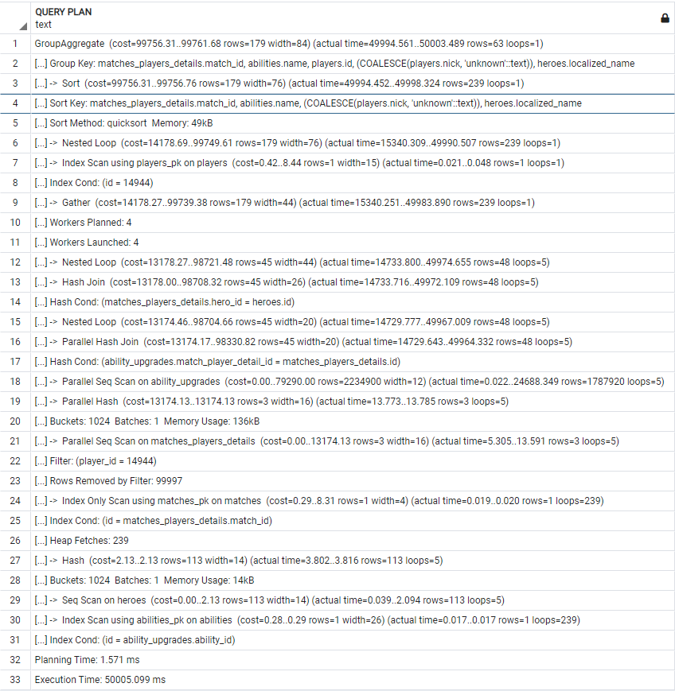

ORM:

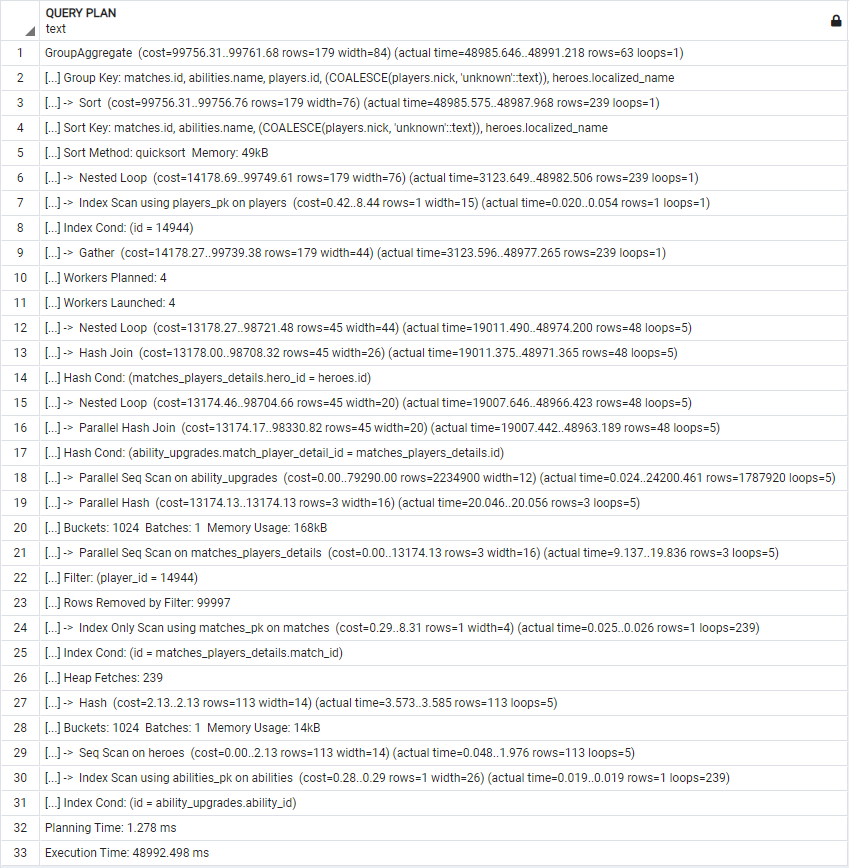

## Zadanie 5 v3/...

### /v3/matches/{id}/top_purchases/

```sql
with res as (SELECT match_id,hero_id,localized_name, item_id,items.name,COUNT(*) FROM matches
INNER JOIN matches_players_details ON match_id = matches.id
INNER JOIN heroes ON heroes.id = hero_id 
LEFT JOIN purchase_logs ON match_player_detail_id = matches_players_details.id
INNER JOIN items ON item_id = items.id
WHERE match_id ={id} and ( matches.radiant_win = (player_slot BETWEEN 0 and 4))
GROUP BY match_id,hero_id,localized_name, item_id,items.name
)
SELECT * FROM (
    SELECT res.*,
    rank() OVER (
        PARTITION BY hero_id
        ORDER BY count DESC,name ASC
    ) FROM res
) as res2
WHERE rank <=5
ORDER BY hero_id ASC,rank ASC
```

**v4/matches/{id}/top_purchases/**:

```sql
SELECT     anon_1.id, 
        anon_1.id_1, 
        anon_1.localized_name, 
        anon_1.id_2, anon_1.name, 
        anon_1.count_1, anon_1.rank 
FROM (SELECT     anon_2.id AS id,
                  anon_2.id_1 AS id_1,
                  anon_2.localized_name AS localized_name,
                  anon_2.id_2 AS id_2, anon_2.name AS name, 
                  anon_2.count_1 AS count_1,
                  rank() 
                  OVER (PARTITION BY anon_2.id_1 
                      ORDER BY anon_2.count_1 DESC, anon_2.name)
                 AS rank
        FROM (
            SELECT matches.id AS id,
                    heroes.id AS id_1, heroes.localized_name AS localized_name,
                    items.id AS id_2, items.name AS name,
                    count('*') AS count_1
            FROM matches 
            JOIN matches_players_details ON matches.id = matches_players_details.match_id
            JOIN heroes ON heroes.id = matches_players_details.hero_id
            JOIN purchase_logs ON matches_players_details.id = purchase_logs.match_player_detail_id
            JOIN items ON items.id = purchase_logs.item_id
            WHERE matches.id = {id} AND 
            matches.radiant_win = (matches_players_details.player_slot >= 0 AND matches_players_details.player_slot <= 4) 
            GROUP BY matches.id, heroes.id, heroes.localized_name, items.id, items.name)
              AS anon_2) 
        AS anon_1
WHERE anon_1.rank < 6 
ORDER BY anon_1.id_1, anon_1.rank
```

Obidve query používajú 3 selecty (2 subquery), pričom naša používa na poslednú subquery WITH. Ďalším rozdielom je, že sme pre pole winner použili BETWEEN a generovaná vypísala hranice pomocou >= a <=.  Ďalším rozdielom je, že na vypísanie všetkých polí zo subquery sme použili res.\* a \*; A generovaná vypisovala všetky polia. Zároveň ako pri iných query je nami používané INNER JOIN iba JOIN v generovanom. Navyše kde sme použili LEFT JOIN a generovaná na jeho mieste použila iba JOIN. Filtrovanie podľa poradia je u nás dané <=5 a v generovanom je < 6.

EXPLAIN ANALYZE: 

| v3                                                                                                                                                         | v4                                                                                                                                                         |
| ---------------------------------------------------------------------------------------------------------------------------------------------------------- | ---------------------------------------------------------------------------------------------------------------------------------------------------------- |
| Sort    (cost=156859.95..156860.10 rows=61 width=52) (actual   time=82299.385..82299.643 rows=25 loops=1)                                                  | Sort  (cost=156858.80..156858.95   rows=61 width=52) (actual time=85506.122..85506.353 rows=25 loops=1)                                                    |
| Sort Key: res2.hero_id, res2.rank                                                                                                                          | Sort Key: anon_1.id_1,   anon_1.rank                                                                                                                       |
| Sort Method: quicksort  Memory:   27kB                                                                                                                     | Sort Method: quicksort  Memory: 27kB                                                                                                                       |
| ->  Subquery Scan on   res2  (cost=156851.77..156858.14   rows=61 width=52) (actual time=82294.432..82299.127 rows=25 loops=1)                             | ->  Subquery Scan on anon_1  (cost=156850.62..156856.99 rows=61   width=52) (actual time=85501.254..85505.860 rows=25 loops=1)                             |
| Filter: (res2.rank <= 5)                                                                                                                                   | Filter: (anon_1.rank <   6)                                                                                                                                |
| Rows Removed by Filter: 88                                                                                                                                 | Rows Removed by Filter: 88                                                                                                                                 |
| ->  WindowAgg  (cost=156851.77..156855.87 rows=182   width=52) (actual time=82294.412..82297.819 rows=113 loops=1)                                         | ->  WindowAgg    (cost=156850.62..156854.72 rows=182 width=52) (actual   time=85501.235..85504.595 rows=113 loops=1)                                       |
| ->  Sort    (cost=156851.77..156852.23 rows=182 width=44) (actual   time=82294.362..82295.422 rows=113 loops=1)                                            | ->  Sort    (cost=156850.62..156851.08 rows=182 width=44) (actual   time=85501.185..85502.257 rows=113 loops=1)                                            |
| Sort Key: res.hero_id,   res.count DESC, res.name                                                                                                          | Sort Key:   anon_2.id_1, anon_2.count_1 DESC, anon_2.name                                                                                                  |
| Sort Method:   quicksort  Memory: 34kB                                                                                                                     | Sort Method:   quicksort  Memory: 34kB                                                                                                                     |
| ->  Subquery Scan on res  (cost=156815.36..156844.94 rows=182   width=44) (actual time=82283.331..82292.760 rows=113 loops=1)                              | ->  Subquery Scan on anon_2  (cost=156815.36..156843.79 rows=182   width=44) (actual time=85489.497..85499.651 rows=113 loops=1)                           |
| ->  Finalize GroupAggregate  (cost=156815.36..156843.12 rows=182   width=44) (actual time=82283.304..82289.822 rows=113 loops=1)                           | ->  Finalize   GroupAggregate    (cost=156815.36..156841.97 rows=182 width=44) (actual   time=85489.473..85496.976 rows=113 loops=1)                       |
| Group Key:   matches_players_details.match_id, matches_players_details.hero_id,   heroes.localized_name, purchase_logs.item_id, items.name                 | Group Key: matches.id, heroes.id, items.id                                                                                                                 |
| ->  Gather Merge  (cost=156815.36..156838.54 rows=184   width=44) (actual time=82283.255..82286.599 rows=114 loops=1)                                      | ->  Gather Merge  (cost=156815.36..156838.31 rows=184   width=44) (actual time=85489.402..85494.087 rows=114 loops=1)                                      |
| Workers   Planned: 4                                                                                                                                       | Workers Planned: 4                                                                                                                                         |
| Workers   Launched: 4                                                                                                                                      | Workers Launched: 4                                                                                                                                        |
| ->  Partial   GroupAggregate    (cost=155815.30..155816.57 rows=46 width=44) (actual   time=82275.721..82277.420 rows=23 loops=5)                          | ->  Partial   GroupAggregate    (cost=155815.30..155816.34 rows=46 width=44) (actual   time=85482.722..85484.013 rows=23 loops=5)                          |
| Group Key: matches_players_details.match_id,   matches_players_details.hero_id, heroes.localized_name,   purchase_logs.item_id, items.name                 | Group Key: matches.id, heroes.id, items.id                                                                                                                 |
| ->  Sort  (cost=155815.30..155815.42 rows=46   width=36) (actual time=82275.672..82276.681 rows=38 loops=5)                                                | ->  Sort  (cost=155815.30..155815.42 rows=46   width=36) (actual time=85482.673..85483.165 rows=38 loops=5)                                                |
| Sort Key: matches_players_details.hero_id, heroes.localized_name,   purchase_logs.item_id, items.name                                                      | Sort Key: heroes.id, items.id                                                                                                                              |
| Sort Method: quicksort  Memory:   25kB                                                                                                                     | Sort Method: quicksort  Memory:   31kB                                                                                                                     |
| Worker 0:  Sort Method:   quicksort  Memory: 25kB                                                                                                          | Worker 0:  Sort Method:   quicksort  Memory: 33kB                                                                                                          |
| Worker 1:  Sort Method:   quicksort  Memory: 31kB                                                                                                          | Worker 1:  Sort Method:   quicksort  Memory: 25kB                                                                                                          |
| Worker 2:  Sort Method:   quicksort  Memory: 33kB                                                                                                          | Worker 2:  Sort Method:   quicksort  Memory: 25kB                                                                                                          |
| Worker 3:  Sort Method:   quicksort  Memory: 25kB                                                                                                          | Worker 3:  Sort Method:   quicksort  Memory: 25kB                                                                                                          |
| ->  Nested Loop  (cost=36.48..155814.03 rows=46 width=36)   (actual time=63531.912..82275.159 rows=38 loops=5)                                             | ->  Nested Loop  (cost=36.48..155814.03 rows=46 width=36)   (actual time=66162.313..85481.948 rows=38 loops=5)                                             |
| ->  Hash Join  (cost=36.34..155806.44 rows=46 width=22)   (actual time=63531.826..82273.357 rows=38 loops=5)                                               | ->  Hash Join  (cost=36.34..155806.44 rows=46 width=22)   (actual time=66162.258..85479.802 rows=38 loops=5)                                               |
| Hash Cond: (matches_players_details.hero_id = heroes.id)                                                                                                   | Hash Cond: (matches_players_details.hero_id = heroes.id)                                                                                                   |
| ->  Hash Join  (cost=32.79..155802.78 rows=46 width=12)   (actual time=63528.239..82268.993 rows=38 loops=5)                                               | ->  Hash Join  (cost=32.79..155802.78 rows=46 width=12)   (actual time=66159.114..85475.696 rows=38 loops=5)                                               |
| Hash Cond: (((matches_players_details.player_slot >= 0) AND   (matches_players_details.player_slot <= 4)) = matches.radiant_win)                           | Hash Cond: (((matches_players_details.player_slot >= 0) AND   (matches_players_details.player_slot <= 4)) = matches.radiant_win)                           |
| ->  Hash Join  (cost=24.47..155793.58 rows=91 width=16)   (actual time=54155.503..82267.540 rows=71 loops=5)                                               | ->  Hash Join  (cost=24.47..155793.58 rows=91 width=16)   (actual time=56497.643..85473.828 rows=71 loops=5)                                               |
| Hash Cond: (purchase_logs.match_player_detail_id =   matches_players_details.id)                                                                           | Hash Cond: (purchase_logs.match_player_detail_id =   matches_players_details.id)                                                                           |
| ->  Parallel Seq Scan on   purchase_logs  (cost=0.00..143829.36 rows=4548436   width=8) (actual time=0.026..40951.701 rows=3638749 loops=5)                | ->  Parallel Seq Scan on   purchase_logs  (cost=0.00..143829.36 rows=4548436   width=8) (actual time=0.023..42560.668 rows=3638749 loops=5)                |
| ->  Hash  (cost=24.35..24.35 rows=10 width=16)   (actual time=0.390..0.403 rows=10 loops=5)                                                                | ->  Hash  (cost=24.35..24.35 rows=10 width=16)   (actual time=0.289..0.301 rows=10 loops=5)                                                                |
| Buckets: 1024  Batches: 1  Memory Usage: 9kB                                                                                                               | Buckets: 1024  Batches: 1  Memory Usage: 9kB                                                                                                               |
| ->  Index Scan using   idx_match_id_player_id on matches_players_details  (cost=0.42..24.35 rows=10 width=16) (actual   time=0.056..0.216 rows=10 loops=5) | ->  Index Scan using   idx_match_id_player_id on matches_players_details  (cost=0.42..24.35 rows=10 width=16) (actual   time=0.046..0.165 rows=10 loops=5) |
| Index Cond: (match_id = 21421)                                                                                                                             | Index Cond: (match_id = 21421)                                                                                                                             |
| ->  Hash  (cost=8.31..8.31 rows=1 width=5) (actual   time=0.118..0.129 rows=1 loops=5)                                                                     | ->  Hash  (cost=8.31..8.31 rows=1 width=5) (actual   time=0.084..0.095 rows=1 loops=5)                                                                     |
| Buckets: 1024  Batches: 1  Memory Usage: 9kB                                                                                                               | Buckets: 1024  Batches: 1  Memory Usage: 9kB                                                                                                               |
| ->  Index Scan using   matches_pk on matches  (cost=0.29..8.31   rows=1 width=5) (actual time=0.046..0.072 rows=1 loops=5)                                 | ->  Index Scan using   matches_pk on matches  (cost=0.29..8.31   rows=1 width=5) (actual time=0.029..0.051 rows=1 loops=5)                                 |
| Index Cond: (id = 21421)                                                                                                                                   | Index Cond: (id = 21421)                                                                                                                                   |
| ->  Hash  (cost=2.13..2.13 rows=113 width=14) (actual   time=3.488..3.499 rows=113 loops=5)                                                                | ->  Hash  (cost=2.13..2.13 rows=113 width=14) (actual   time=2.544..2.555 rows=113 loops=5)                                                                |
| Buckets: 1024  Batches: 1  Memory Usage: 14kB                                                                                                              | Buckets: 1024  Batches: 1  Memory Usage: 14kB                                                                                                              |
| ->  Seq Scan on heroes  (cost=0.00..2.13 rows=113 width=14) (actual   time=0.032..1.734 rows=113 loops=5)                                                  | ->  Seq Scan on heroes  (cost=0.00..2.13 rows=113 width=14) (actual   time=0.029..1.285 rows=113 loops=5)                                                  |
| ->  Index Scan using items_pk   on items  (cost=0.15..0.17 rows=1   width=18) (actual time=0.015..0.015 rows=1 loops=188)                                  | ->  Index Scan using items_pk   on items  (cost=0.15..0.17 rows=1   width=18) (actual time=0.018..0.018 rows=1 loops=188)                                  |
| Index Cond: (id = purchase_logs.item_id)                                                                                                                   | Index Cond: (id = purchase_logs.item_id)                                                                                                                   |
| Planning Time: 1.081 ms                                                                                                                                    | Planning Time: 1.053 ms                                                                                                                                    |
| Execution Time: 82300.561 ms                                                                                                                               | Execution Time: 85507.193 ms                                                                                                                               |

Väčšina riadkov v analýze v3 a v4 sú rovnaké, jedine čo sa vo väčšine mení iba actual_time. Cost je rôzny iba v niektorých krokoch, ale rozdiely sú minimálne (napr. v riadku 3. Scan Query ich rozdiely sú 1.15..1.15 [orm ma menšie hodnoty]). Rovnaký rozdiel cost hodnôt sa nesie od prvého riadka po riadok 12, potom sa zmení rozdiel cost hodnôt na 0..0.23 a po riadku 17 (Partial GroupAggregate) sa cost hodnoty rovnajú. Hodnoty rows sa v každej operácií rovnajú. Čas plánovania je približne rovnaký pre obidva dotazy. Na druhú stranu, čas vykonávania bol lepší, aj keď iba o ~3200ms, pre náš dotaz. Actual_time bol v prvých riadkoch menší pre našu query, ale od riadku 33 má menší actual_time orm dotaz. Posledná operácia Index Scan mala actual_time menší pre náš dotaz a to o 0.03 ms.
Celkovo sú dopyty rovnaké, hlavným rozdielom je, že my sme použili WITH. EXPLAIN ANALYZE vrátilo podobné plány s malými rozdielmi v cost hodnotách ako aj času.

Náš:

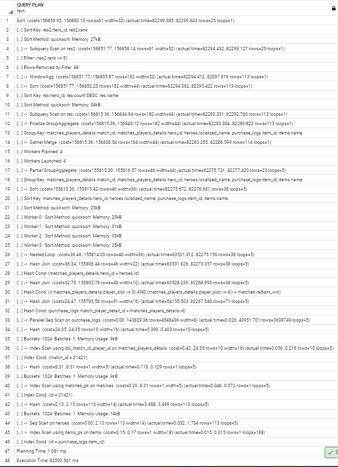

ORM:

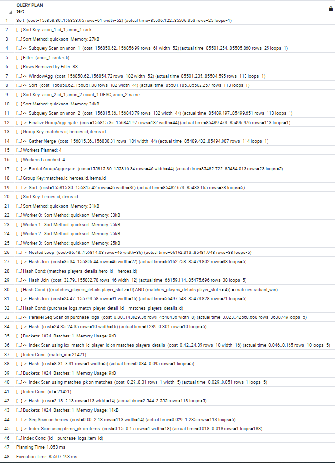

### /v3/abilities/{id}/usage/

```sql
with ability as (SELECT abilities.id,
                 abilities.name,
                 hero_id,
                 localized_name,
                 matches.radiant_win = (player_slot BETWEEN 0 and 4) as winner,
                 case when 10*FLOOR((time*100/duration)/10) < 101 then 10*FLOOR((time*100/duration)/10) || '-' || 10*FLOOR((time*100/duration)/10)+9
                  else '100-109'
                 end bucket,
                 COUNT(*)
                 FROM abilities
                 INNER JOIN ability_upgrades ON abilities.id = ability_id
                 LEFT JOIN matches_players_details as mpd ON match_player_detail_id = mpd.id
                 LEFT JOIN heroes ON hero_id = heroes.id
                 LEFT JOIN matches ON match_id = matches.id
                 WHERE abilities.id = {id}
                 GROUP BY abilities.id, abilities.name, hero_id, localized_name,winner,bucket
                )
SELECT * FROM (SELECT ability.*,RANK() OVER (
    PARTITION BY hero_id,winner
    ORDER BY count DESC,bucket ASC
) FROM ability) as res
WHERE rank =1
ORDER BY hero_id ASC ,winner DESC
```

**v4/abilities/{id}/usage/**:

```sql
SELECT     anon_1.id, anon_1.name, anon_1.hero_id,
        anon_1.localized_name, anon_1.winner, 
        anon_1.bucket, anon_1.count_1, anon_1.rank 
FROM (SELECT     anon_2.id AS id, anon_2.name AS name, 
                  anon_2.hero_id AS hero_id, anon_2.localized_name AS localized_name,
                  anon_2.winner AS winner, anon_2.bucket AS bucket, anon_2.count_1 AS count_1,
                  rank() OVER (
                    PARTITION BY anon_2.hero_id, anon_2.winner 
                    ORDER BY anon_2.count_1 DESC, anon_2.bucket ASC
                ) AS rank
        FROM (SELECT     abilities.id AS id, abilities.name AS name,
                          heroes.id AS hero_id, heroes.localized_name AS localized_name,
                          matches.radiant_win = (matches_players_details.player_slot >= 0 AND matches_players_details.player_slot <= 4) AS winner,
                          CASE WHEN (10 * floor(((ability_upgrades.time * 100) / matches.duration) / 10) < 101) 
                          THEN CAST(10 * floor(((ability_upgrades.time * 100) / matches.duration) / 10) AS TEXT) || '-' || CAST(10 * floor(((ability_upgrades.time * 100) / matches.duration) / 10) + 9 AS TEXT) 
                          ELSE '100-109' END AS bucket, count('*') AS count_1
            FROM abilities 
            JOIN ability_upgrades ON abilities.id = ability_upgrades.ability_id
            JOIN matches_players_details ON matches_players_details.id = ability_upgrades.match_player_detail_id
            JOIN heroes ON heroes.id = matches_players_details.hero_id
            JOIN matches ON matches.id = matches_players_details.match_id
            WHERE abilities.id = {id}
            GROUP BY abilities.id, abilities.name, heroes.id, heroes.localized_name, matches.radiant_win = (matches_players_details.player_slot >= 0 AND matches_players_details.player_slot <= 4), bucket
        ) AS anon_2
    )AS anon_1
WHERE anon_1.rank = 1 ORDER BY anon_1.hero_id, anon_1.winner
```

Obidve query používajú 3 selecty (2 subquery), pričom naša používa na poslednú subquery WITH. Ďalším rozdielom je, že sme pre pole winner použili BETWEEN a generovaná vypísala hranice pomocou >= a <=. Navyše pri skladaní stringov mi máme iba vzorec, ktorý sa pripája, ale orm dotaz hodnotu vzorca pomocou AS konvertuje na TEXT. Zároveň ako pri iných query je nami používané INNER JOIN iba JOIN v generovanom. Navyše kde sme použili LEFT JOIN a generovaná na jeho mieste použila iba JOIN.

EXPLAIN ANALYZE: 

| v3                                                                                                                                                                                                                                                                                                                                                                                                                                                                                                                                                                                                                                                      | v4                                                                                                                                                                                                                                                                                                                                                                                                                                                                                                                                                                                                                                                                     |
| ------------------------------------------------------------------------------------------------------------------------------------------------------------------------------------------------------------------------------------------------------------------------------------------------------------------------------------------------------------------------------------------------------------------------------------------------------------------------------------------------------------------------------------------------------------------------------------------------------------------------------------------------------- | ---------------------------------------------------------------------------------------------------------------------------------------------------------------------------------------------------------------------------------------------------------------------------------------------------------------------------------------------------------------------------------------------------------------------------------------------------------------------------------------------------------------------------------------------------------------------------------------------------------------------------------------------------------------------- |
| Sort  (cost=117794.32..117794.79 rows=191   width=89) (actual time=4873.106..4873.141 rows=3 loops=1)                                                                                                                                                                                                                                                                                                                                                                                                                                                                                                                                                   | Subquery Scan on anon_1    (cost=116261.40..117691.72 rows=191 width=89) (actual   time=4932.784..4933.739 rows=3 loops=1)                                                                                                                                                                                                                                                                                                                                                                                                                                                                                                                                             |
| Sort Key: res.hero_id, res.winner DESC                                                                                                                                                                                                                                                                                                                                                                                                                                                                                                                                                                                                                  | Filter: (anon_1.rank =   1)                                                                                                                                                                                                                                                                                                                                                                                                                                                                                                                                                                                                                                            |
| Sort Method: quicksort  Memory: 25kB                                                                                                                                                                                                                                                                                                                                                                                                                                                                                                                                                                                                                    | Rows Removed by   Filter: 20                                                                                                                                                                                                                                                                                                                                                                                                                                                                                                                                                                                                                                           |
| ->    Subquery Scan on res    (cost=116356.75..117787.08 rows=191 width=89) (actual   time=4872.137..4873.029 rows=3 loops=1)                                                                                                                                                                                                                                                                                                                                                                                                                                                                                                                           | ->  WindowAgg    (cost=116261.40..117214.95 rows=38142 width=89) (actual   time=4932.762..4933.475 rows=23 loops=1)                                                                                                                                                                                                                                                                                                                                                                                                                                                                                                                                                    |
| Filter: (res.rank = 1)                                                                                                                                                                                                                                                                                                                                                                                                                                                                                                                                                                                                                                  | ->  Sort    (cost=116261.40..116356.75 rows=38142 width=81) (actual   time=4932.702..4932.957 rows=23 loops=1)                                                                                                                                                                                                                                                                                                                                                                                                                                                                                                                                                         |
| Rows Removed by Filter: 20                                                                                                                                                                                                                                                                                                                                                                                                                                                                                                                                                                                                                              | Sort Key:   anon_2.hero_id, anon_2.winner, anon_2.count_1 DESC, anon_2.bucket                                                                                                                                                                                                                                                                                                                                                                                                                                                                                                                                                                                          |
| ->    WindowAgg    (cost=116356.75..117310.30 rows=38142 width=89) (actual   time=4872.116..4872.773 rows=23 loops=1)                                                                                                                                                                                                                                                                                                                                                                                                                                                                                                                                   | Sort   Method: quicksort  Memory: 28kB                                                                                                                                                                                                                                                                                                                                                                                                                                                                                                                                                                                                                                 |
| ->  Sort    (cost=116356.75..116452.11 rows=38142 width=81) (actual   time=4872.066..4872.280 rows=23 loops=1)                                                                                                                                                                                                                                                                                                                                                                                                                                                                                                                                          | ->  Subquery Scan on anon_2  (cost=109830.83..113358.97 rows=38142   width=81) (actual time=4931.352..4932.428 rows=23 loops=1)                                                                                                                                                                                                                                                                                                                                                                                                                                                                                                                                        |
| Sort Key:   ability.hero_id, ability.winner, ability.count DESC, ability.bucket                                                                                                                                                                                                                                                                                                                                                                                                                                                                                                                                                                         | ->  HashAggregate  (cost=109830.83..112977.55 rows=38142   width=81) (actual time=4931.332..4931.967 rows=23 loops=1)                                                                                                                                                                                                                                                                                                                                                                                                                                                                                                                                                  |
| Sort Method:   quicksort  Memory: 28kB                                                                                                                                                                                                                                                                                                                                                                                                                                                                                                                                                                                                                  | Group Key: abilities.id, heroes.id, (matches.radiant_win =   ((matches_players_details.player_slot >= 0) AND   (matches_players_details.player_slot <= 4))), CASE WHEN (('10'::double   precision * floor(((((ability_upgrades."time" * 100) /   matches.duration) / 10))::double precision)) < '101'::double precision)   THEN (((('10'::double precision * floor(((((ability_upgrades."time"   * 100) / matches.duration) / 10))::double precision)))::text \|\| '-'::text) \|\|   ((('10'::double precision * floor(((((ability_upgrades."time" *   100) / matches.duration) / 10))::double precision)) + '9'::double   precision))::text) ELSE '100-109'::text END |
| ->  Subquery Scan on ability  (cost=109926.19..113454.32 rows=38142   width=81) (actual time=4870.768..4871.801 rows=23 loops=1)                                                                                                                                                                                                                                                                                                                                                                                                                                                                                                                        | ->  Nested Loop  (cost=17431.85..109354.06 rows=38142   width=73) (actual time=3360.774..4522.129 rows=37068 loops=1)                                                                                                                                                                                                                                                                                                                                                                                                                                                                                                                                                  |
| ->  HashAggregate  (cost=109926.19..113072.90 rows=38142   width=81) (actual time=4870.737..4871.354 rows=23 loops=1)                                                                                                                                                                                                                                                                                                                                                                                                                                                                                                                                   | ->  Index Scan using   abilities_pk on abilities    (cost=0.28..8.29 rows=1 width=26) (actual time=0.020..0.041 rows=1   loops=1)                                                                                                                                                                                                                                                                                                                                                                                                                                                                                                                                      |
| Group Key:   abilities.id, mpd.hero_id, heroes.localized_name, (matches.radiant_win =   ((mpd.player_slot >= 0) AND (mpd.player_slot <= 4))), CASE WHEN   (('10'::double precision * floor(((((ability_upgrades."time" * 100)   / matches.duration) / 10))::double precision)) < '101'::double precision)   THEN (((('10'::double precision * floor(((((ability_upgrades."time"   * 100) / matches.duration) / 10))::double precision)))::text \|\| '-'::text) \|\|   ((('10'::double precision * floor(((((ability_upgrades."time" *   100) / matches.duration) / 10))::double precision)) + '9'::double   precision))::text) ELSE '100-109'::text END | Index   Cond: (id = 5004)                                                                                                                                                                                                                                                                                                                                                                                                                                                                                                                                                                                                                                              |
| ->  Nested Loop    (cost=17431.85..109354.06 rows=38142 width=73) (actual   time=3256.513..4447.179 rows=37068 loops=1)                                                                                                                                                                                                                                                                                                                                                                                                                                                                                                                                 | ->  Gather  (cost=17431.57..106199.05 rows=38142   width=31) (actual time=3360.692..3744.131 rows=37068 loops=1)                                                                                                                                                                                                                                                                                                                                                                                                                                                                                                                                                       |
| ->  Index Scan using   abilities_pk on abilities    (cost=0.28..8.29 rows=1 width=26) (actual time=0.016..0.037 rows=1   loops=1)                                                                                                                                                                                                                                                                                                                                                                                                                                                                                                                       | Workers   Planned: 4                                                                                                                                                                                                                                                                                                                                                                                                                                                                                                                                                                                                                                                   |
| Index Cond: (id = 5004)                                                                                                                                                                                                                                                                                                                                                                                                                                                                                                                                                                                                                                 | Workers   Launched: 4                                                                                                                                                                                                                                                                                                                                                                                                                                                                                                                                                                                                                                                  |
| ->  Gather  (cost=17431.57..106199.05 rows=38142   width=31) (actual time=3256.434..3646.106 rows=37068 loops=1)                                                                                                                                                                                                                                                                                                                                                                                                                                                                                                                                        | ->  Hash Join  (cost=16431.57..101384.85 rows=9536   width=31) (actual time=3354.952..4078.788 rows=7414 loops=5)                                                                                                                                                                                                                                                                                                                                                                                                                                                                                                                                                      |
| Workers Planned: 4                                                                                                                                                                                                                                                                                                                                                                                                                                                                                                                                                                                                                                      | Hash Cond: (matches_players_details.match_id = matches.id)                                                                                                                                                                                                                                                                                                                                                                                                                                                                                                                                                                                                             |
| Workers Launched: 4                                                                                                                                                                                                                                                                                                                                                                                                                                                                                                                                                                                                                                     | ->  Hash Join  (cost=14790.57..99718.82 rows=9536   width=30) (actual time=2203.710..2770.376 rows=7414 loops=5)                                                                                                                                                                                                                                                                                                                                                                                                                                                                                                                                                       |
| ->  Hash Left Join  (cost=16431.57..101384.85 rows=9536   width=31) (actual time=3248.454..3948.327 rows=7414 loops=5)                                                                                                                                                                                                                                                                                                                                                                                                                                                                                                                                  | Hash Cond: (matches_players_details.hero_id = heroes.id)                                                                                                                                                                                                                                                                                                                                                                                                                                                                                                                                                                                                               |
| Hash Cond: (mpd.match_id = matches.id)                                                                                                                                                                                                                                                                                                                                                                                                                                                                                                                                                                                                                  | ->  Parallel Hash Join  (cost=14787.03..99689.31 rows=9536   width=20) (actual time=2201.173..2612.753 rows=7414 loops=5)                                                                                                                                                                                                                                                                                                                                                                                                                                                                                                                                              |
| ->  Hash Left Join  (cost=14790.57..99718.82 rows=9536   width=30) (actual time=2171.649..2719.134 rows=7414 loops=5)                                                                                                                                                                                                                                                                                                                                                                                                                                                                                                                                   | Hash Cond: (ability_upgrades.match_player_detail_id =   matches_players_details.id)                                                                                                                                                                                                                                                                                                                                                                                                                                                                                                                                                                                    |
| Hash Cond: (mpd.hero_id = heroes.id)                                                                                                                                                                                                                                                                                                                                                                                                                                                                                                                                                                                                                    | ->  Parallel Seq Scan on   ability_upgrades  (cost=0.00..84877.25   rows=9536 width=12) (actual time=0.100..250.053 rows=7414 loops=5)                                                                                                                                                                                                                                                                                                                                                                                                                                                                                                                                 |
| ->  Parallel Hash Left   Join  (cost=14787.03..99689.31   rows=9536 width=20) (actual time=2169.170..2566.480 rows=7414 loops=5)                                                                                                                                                                                                                                                                                                                                                                                                                                                                                                                        | Filter: (ability_id = 5004)                                                                                                                                                                                                                                                                                                                                                                                                                                                                                                                                                                                                                                            |
| Hash Cond: (ability_upgrades.match_player_detail_id = mpd.id)                                                                                                                                                                                                                                                                                                                                                                                                                                                                                                                                                                                           | Rows Removed by Filter: 1780506                                                                                                                                                                                                                                                                                                                                                                                                                                                                                                                                                                                                                                        |
| ->  Parallel Seq Scan on   ability_upgrades  (cost=0.00..84877.25   rows=9536 width=12) (actual time=0.101..240.298 rows=7414 loops=5)                                                                                                                                                                                                                                                                                                                                                                                                                                                                                                                  | ->  Parallel Hash  (cost=12770.90..12770.90 rows=161290   width=16) (actual time=2200.459..2200.469 rows=100000 loops=5)                                                                                                                                                                                                                                                                                                                                                                                                                                                                                                                                               |
| Filter: (ability_id = 5004)                                                                                                                                                                                                                                                                                                                                                                                                                                                                                                                                                                                                                             | Buckets: 524288  Batches: 1  Memory Usage: 27680kB                                                                                                                                                                                                                                                                                                                                                                                                                                                                                                                                                                                                                     |
| Rows Removed by Filter: 1780506                                                                                                                                                                                                                                                                                                                                                                                                                                                                                                                                                                                                                         | ->  Parallel Seq Scan on   matches_players_details    (cost=0.00..12770.90 rows=161290 width=16) (actual   time=0.020..1084.385 rows=100000 loops=5)                                                                                                                                                                                                                                                                                                                                                                                                                                                                                                                   |
| ->  Parallel Hash  (cost=12770.90..12770.90 rows=161290   width=16) (actual time=2168.344..2168.353 rows=100000 loops=5)                                                                                                                                                                                                                                                                                                                                                                                                                                                                                                                                | ->  Hash  (cost=2.13..2.13 rows=113 width=14) (actual   time=2.469..2.479 rows=113 loops=5)                                                                                                                                                                                                                                                                                                                                                                                                                                                                                                                                                                            |
| Buckets: 524288  Batches: 1  Memory Usage: 27648kB                                                                                                                                                                                                                                                                                                                                                                                                                                                                                                                                                                                                      | Buckets: 1024  Batches: 1  Memory Usage: 14kB                                                                                                                                                                                                                                                                                                                                                                                                                                                                                                                                                                                                                          |
| ->  Parallel Seq Scan on   matches_players_details mpd    (cost=0.00..12770.90 rows=161290 width=16) (actual   time=0.020..1073.085 rows=100000 loops=5)                                                                                                                                                                                                                                                                                                                                                                                                                                                                                                | ->  Seq Scan on heroes  (cost=0.00..2.13 rows=113 width=14) (actual   time=0.043..1.233 rows=113 loops=5)                                                                                                                                                                                                                                                                                                                                                                                                                                                                                                                                                              |
| ->  Hash  (cost=2.13..2.13 rows=113 width=14) (actual   time=2.391..2.401 rows=113 loops=5)                                                                                                                                                                                                                                                                                                                                                                                                                                                                                                                                                             | ->  Hash  (cost=1016.00..1016.00 rows=50000 width=9)   (actual time=1150.745..1150.755 rows=50000 loops=5)                                                                                                                                                                                                                                                                                                                                                                                                                                                                                                                                                             |
| Buckets: 1024  Batches: 1  Memory Usage: 14kB                                                                                                                                                                                                                                                                                                                                                                                                                                                                                                                                                                                                           | Buckets: 65536  Batches: 1  Memory Usage: 2661kB                                                                                                                                                                                                                                                                                                                                                                                                                                                                                                                                                                                                                       |
| ->  Seq Scan on heroes  (cost=0.00..2.13 rows=113 width=14) (actual   time=0.064..1.224 rows=113 loops=5)                                                                                                                                                                                                                                                                                                                                                                                                                                                                                                                                               | ->  Seq Scan on matches  (cost=0.00..1016.00 rows=50000 width=9)   (actual time=0.037..572.621 rows=50000 loops=5)                                                                                                                                                                                                                                                                                                                                                                                                                                                                                                                                                     |
| ->  Hash  (cost=1016.00..1016.00 rows=50000 width=9)   (actual time=1076.380..1076.389 rows=50000 loops=5)                                                                                                                                                                                                                                                                                                                                                                                                                                                                                                                                              | Planning Time: 1.040 ms                                                                                                                                                                                                                                                                                                                                                                                                                                                                                                                                                                                                                                                |
| Buckets: 65536  Batches: 1  Memory Usage: 2661kB                                                                                                                                                                                                                                                                                                                                                                                                                                                                                                                                                                                                        | Execution Time: 4935.841 ms                                                                                                                                                                                                                                                                                                                                                                                                                                                                                                                                                                                                                                            |
| ->  Seq Scan on matches  (cost=0.00..1016.00 rows=50000 width=9)   (actual time=0.036..535.533 rows=50000 loops=5)                                                                                                                                                                                                                                                                                                                                                                                                                                                                                                                                      |                                                                                                                                                                                                                                                                                                                                                                                                                                                                                                                                                                                                                                                                        |
| Planning Time: 1.223 ms                                                                                                                                                                                                                                                                                                                                                                                                                                                                                                                                                                                                                                 |                                                                                                                                                                                                                                                                                                                                                                                                                                                                                                                                                                                                                                                                        |
| Execution Time: 4875.257 ms                                                                                                                                                                                                                                                                                                                                                                                                                                                                                                                                                                                                                             |                                                                                                                                                                                                                                                                                                                                                                                                                                                                                                                                                                                                                                                                        |

Plán našej query je dlhší o 3 riadky, to je hlavne kvôli tomu, že na začiatku vykonáva operácia Sort. Po tejto operácií sú operácie totožné. Riadky po operáciu HashAggregate (vrátane) majú menší cost pre orm vygenerovanú query, ale rozdiely sú minimálne resp približne o 100ms. Ostatné riadky od tohto bodu sú totožné. Rows sú rovnaké pre všetky totožné operácie. Rýchlosti operácií sú približne rovnaké. Plánovanie zabralo približne rovnaký čas. Vykonávanie v4 je pomalší ~60 ms.

Query sú teda približne rovnaké až na použitie WITH a plány sa hlavne líšia v prvom kroku, kde bola pre náš dopyt použitá operácia SORT.

Náš:

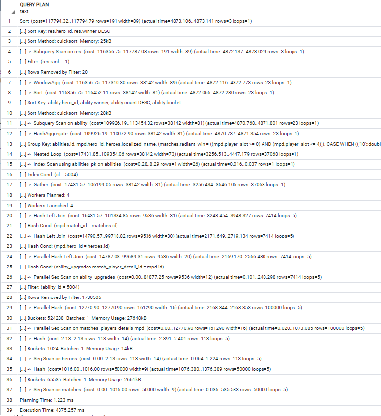

ORM:

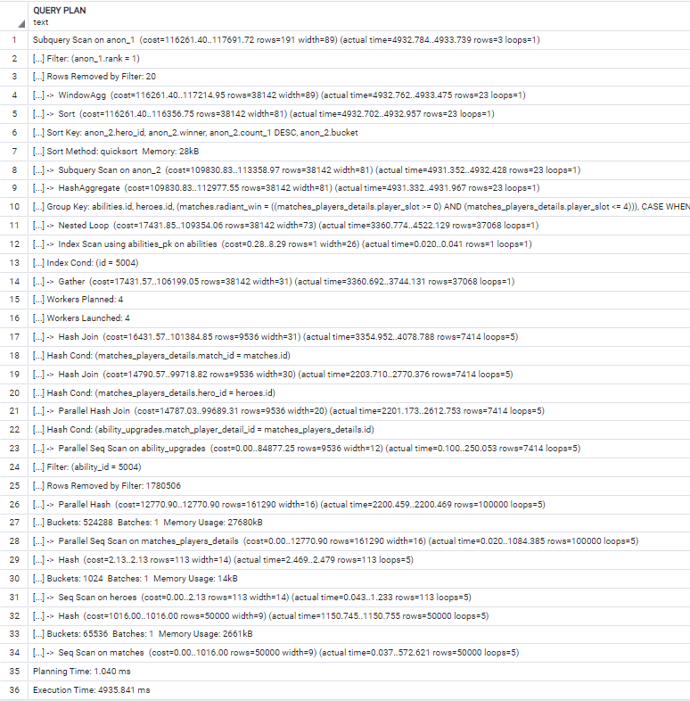

### /v3/statistics/tower_kills/

```sql
with res as (SELECT hero_id,localized_name,match_id,subtype, time FROM heroes
    LEFT JOIN matches_players_details as mpd ON hero_id = heroes.id
    LEFT JOIN matches ON match_id = matches.id
    LEFT JOIN game_objectives as go ON match_player_detail_id_1 = mpd.id
    WHERE go.subtype = 'CHAT_MESSAGE_TOWER_KILL' and time <= duration
    ORDER BY match_id ASC, time ASC)
SELECT hero_id,localized_name,max(seqnum) as sequence FROM (
    select hero_id,localized_name,match_id,
    row_number() over (partition by hero_id,match_id, poradie order by match_id ASC, time ASC) as seqnum
    from (select res.*,
             (row_number() over (order by match_id ASC, time ASC) -
              row_number() over (partition by hero_id,match_id order by match_id ASC, time ASC)
             ) as poradie
            from res ) as t
    ORDER BY match_id ASC, time ASC ) as ta
GROUP BY hero_id,localized_name
ORDER BY sequence DESC, localized_name ASC
```


**v4/statistics/tower_kills/**:

```sql
SELECT anon_1.hero_id, anon_1.localized_name, max(anon_1.seq) AS sequence 
FROM (
    SELECT anon_2.hero_id AS hero_id, anon_2.localized_name AS localized_name,
    row_number() OVER (
        PARTITION BY anon_2.hero_id, anon_2.match_id, anon_2.poradie
        ORDER BY anon_2.match_id, anon_2.time) AS seq
    FROM (SELECT anon_3.hero_id AS hero_id, anon_3.localized_name AS localized_name,
          anon_3.match_id AS match_id, anon_3.time AS time,
          row_number() OVER (ORDER BY anon_3.match_id, anon_3.time) - 
          row_number() OVER (
              PARTITION BY anon_3.hero_id, anon_3.match_id
              ORDER BY anon_3.match_id, anon_3.time) AS poradie
        FROM (SELECT heroes.id AS hero_id, heroes.localized_name AS localized_name,
              matches_players_details.match_id AS match_id, game_objectives.time AS time
            FROM heroes 
            LEFT OUTER JOIN matches_players_details ON heroes.id = matches_players_details.hero_id 
            JOIN matches ON matches.id = matches_players_details.match_id 
            JOIN game_objectives ON matches_players_details.id = game_objectives.match_player_detail_id_1
            WHERE game_objectives.subtype = 'CHAT_MESSAGE_TOWER_KILL' AND game_objectives.time <= matches.duration) 
          AS anon_3)
    AS anon_2) 
    AS anon_1 
GROUP BY anon_1.hero_id, anon_1.localized_name
ORDER BY sequence DESC, anon_1.localized_name ASC
```

Obidve query používajú 4 query z toho sú 3 subquery. Najhlbšia query je v našom dopyte používaná pomocou WITH.  Tam kde sme použili LEFT JOIN je vo väčšine premenený na JOIN až na LEFT JOIN s matches_players_details, kde generovaná použila LEFT OUTER JOIN. My v našom WITH selecte zoraďujeme podľa match_id a času, čo je nadbytočné.

EXPLAIN ANALYZE: 

| v3                                                                                                                                                       | v4                                                                                                                                          |
| -------------------------------------------------------------------------------------------------------------------------------------------------------- | ------------------------------------------------------------------------------------------------------------------------------------------- |
| Sort  (cost=188463.02..188999.19 rows=214467   width=22) (actual time=112688.251..112689.237 rows=110 loops=1)                                           | Sort    (cost=158524.18..159078.22 rows=221615 width=22) (actual   time=118800.672..118801.700 rows=110 loops=1)                            |
| Sort Key: (max((row_number() OVER (?))))   DESC, t.localized_name                                                                                        | Sort Key:   (max((row_number() OVER (?)))) DESC, anon_2.localized_name                                                                      |
| Sort Method: quicksort  Memory: 33kB                                                                                                                     | Sort Method:   quicksort  Memory: 33kB                                                                                                      |
| ->    HashAggregate    (cost=167326.87..169471.54 rows=214467 width=22) (actual   time=112684.662..112687.113 rows=110 loops=1)                          | ->  HashAggregate  (cost=136631.17..138847.32 rows=221615   width=22) (actual time=118796.821..118799.432 rows=110 loops=1)                 |
| Group Key: t.hero_id,   t.localized_name                                                                                                                 | Group Key:   anon_2.hero_id, anon_2.localized_name                                                                                          |
| ->    Sort  (cost=163037.53..163573.70   rows=214467 width=38) (actual time=103417.828..107916.518 rows=475701   loops=1)                                | ->  WindowAgg    (cost=126658.49..132752.91 rows=221615 width=38) (actual   time=99668.834..113974.176 rows=475701 loops=1)                 |
| Sort Key: t.match_id,   t."time"                                                                                                                         | ->  Sort    (cost=126658.49..127212.53 rows=221615 width=30) (actual   time=99668.754..104167.539 rows=475701 loops=1)                      |
| Sort Method: quicksort  Memory: 52156kB                                                                                                                  | Sort   Key: anon_2.hero_id, anon_2.match_id, anon_2.poradie, anon_2."time"                                                                  |
| ->  WindowAgg    (cost=138148.21..144046.06 rows=214467 width=38) (actual   time=83850.216..98384.547 rows=475701 loops=1)                               | Sort   Method: quicksort  Memory: 49453kB                                                                                                   |
| ->  Sort    (cost=138148.21..138684.38 rows=214467 width=30) (actual   time=83850.142..88415.346 rows=475701 loops=1)                                    | ->  Subquery Scan on   anon_2  (cost=99779.15..106981.64   rows=221615 width=30) (actual time=71773.778..94729.580 rows=475701 loops=1)     |
| Sort Key:   t.hero_id, t.match_id, t.poradie, t."time"                                                                                                   | ->  WindowAgg  (cost=99779.15..104765.49 rows=221615   width=30) (actual time=71773.753..85791.309 rows=475701 loops=1)                     |
| Sort Method:   quicksort  Memory: 49453kB                                                                                                                | ->  Sort  (cost=99779.15..100333.19 rows=221615   width=30) (actual time=71773.691..76262.335 rows=475701 loops=1)                          |
| ->  Subquery Scan on t  (cost=112186.56..119156.74 rows=214467   width=30) (actual time=55707.641..78890.205 rows=475701 loops=1)                        | Sort   Key: matches_players_details.match_id, game_objectives."time"                                                                        |
| ->  WindowAgg    (cost=112186.56..117012.07 rows=214467 width=62) (actual   time=55707.621..69877.807 rows=475701 loops=1)                               | Sort   Method: quicksort  Memory: 49453kB                                                                                                   |
| ->  Sort  (cost=112186.56..112722.73 rows=214467   width=30) (actual time=55707.560..60238.891 rows=475701 loops=1)                                      | ->  WindowAgg  (cost=74561.91..80102.29 rows=221615   width=30) (actual time=52419.583..66860.160 rows=475701 loops=1)                      |
| Sort Key: res.match_id, res."time"                                                                                                                       | ->  Sort  (cost=74561.91..75115.95 rows=221615   width=22) (actual time=52419.511..57005.853 rows=475701 loops=1)                           |
| Sort Method: quicksort  Memory:   49453kB                                                                                                                | Sort Key: heroes.id, matches_players_details.match_id,   game_objectives."time"                                                             |
| ->  WindowAgg  (cost=87833.41..93195.08 rows=214467   width=30) (actual time=36074.785..50743.009 rows=475701 loops=1)                                   | Sort Method: quicksort  Memory:   49386kB                                                                                                   |
| ->  Sort  (cost=87833.41..88369.57 rows=214467   width=22) (actual time=36074.728..40729.181 rows=475701 loops=1)                                        | ->  Hash Join  (cost=24052.54..54885.06 rows=221615   width=22) (actual time=11685.657..47399.804 rows=475701 loops=1)                      |
| Sort Key: res.hero_id, res.match_id, res."time"                                                                                                          | Hash Cond: (matches_players_details.hero_id = heroes.id)                                                                                    |
| Sort Method: quicksort  Memory:   49386kB                                                                                                                | ->  Hash Join  (cost=24049.00..54277.96 rows=221615   width=12) (actual time=11682.001..38366.874 rows=475701 loops=1)                      |
| ->  Subquery Scan on res  (cost=41318.66..68841.93 rows=214467   width=22) (actual time=14849.925..31074.373 rows=475701 loops=1)                        | Hash Cond: (matches_players_details.match_id = matches.id)                                                                                  |
| ->  Gather Merge  (cost=41318.66..66697.26 rows=214467   width=54) (actual time=14849.903..21914.770 rows=475701 loops=1)                                | Join Filter: (game_objectives."time" <= matches.duration)                                                                                   |
| Workers Planned: 3                                                                                                                                       | Rows Removed by Join Filter: 9                                                                                                              |
| Workers Launched: 3                                                                                                                                      | ->  Hash Join  (cost=22408.00..50891.68 rows=664846   width=12) (actual time=10377.790..28028.632 rows=475710 loops=1)                      |
| ->  Sort  (cost=40318.62..40497.35 rows=71489   width=54) (actual time=14843.188..16072.390 rows=118925 loops=4)                                         | Hash Cond: (game_objectives.match_player_detail_id_1 =   matches_players_details.id)                                                        |
| Sort Key: mpd.match_id, go."time"                                                                                                                        | ->  Seq Scan on   game_objectives  (cost=0.00..26738.45   rows=664846 width=8) (actual time=0.028..6690.791 rows=663032 loops=1)            |
| Sort Method: quicksort  Memory:   12493kB                                                                                                                | Filter: (subtype = 'CHAT_MESSAGE_TOWER_KILL'::text)                                                                                         |
| Worker 0:  Sort Method:   quicksort  Memory: 12318kB                                                                                                     | Rows Removed by Filter: 510364                                                                                                              |
| Worker 1:  Sort Method:   quicksort  Memory: 12310kB                                                                                                     | ->  Hash  (cost=16158.00..16158.00 rows=500000   width=12) (actual time=10377.134..10377.143 rows=500000 loops=1)                           |
| Worker 2:  Sort Method:   quicksort  Memory: 12267kB                                                                                                     | Buckets: 524288  Batches: 1  Memory Usage: 25581kB                                                                                          |
| ->  Hash Join  (cost=16431.57..34554.67 rows=71489   width=54) (actual time=3768.129..13525.319 rows=118925 loops=4)                                     | ->  Seq Scan on   matches_players_details    (cost=0.00..16158.00 rows=500000 width=12) (actual   time=0.021..5149.981 rows=500000 loops=1) |
| Hash Cond: (mpd.hero_id = heroes.id)                                                                                                                     | ->  Hash  (cost=1016.00..1016.00 rows=50000 width=8)   (actual time=1304.065..1304.074 rows=50000 loops=1)                                  |
| ->  Hash Join  (cost=16428.03..34356.42 rows=71489 width=12)   (actual time=3764.234..11054.642 rows=118925 loops=4)                                     | Buckets: 65536  Batches: 1  Memory Usage: 2466kB                                                                                            |
| Hash Cond: (mpd.match_id = matches.id)                                                                                                                   | ->  Seq Scan on matches  (cost=0.00..1016.00 rows=50000 width=8)   (actual time=0.023..651.138 rows=50000 loops=1)                          |
| Join Filter: (go."time" <= matches.duration)                                                                                                             | ->  Hash  (cost=2.13..2.13 rows=113 width=14) (actual   time=3.611..3.620 rows=113 loops=1)                                                 |
| Rows Removed by Join Filter: 2                                                                                                                           | Buckets: 1024  Batches: 1  Memory Usage: 14kB                                                                                               |
| ->  Parallel Hash Join  (cost=14787.03..32152.44 rows=214466   width=12) (actual time=2713.021..7541.608 rows=118928 loops=4)                            | ->  Seq Scan on heroes  (cost=0.00..2.13 rows=113 width=14) (actual   time=0.028..1.474 rows=113 loops=1)                                   |
| Hash Cond: (go.match_player_detail_id_1 = mpd.id)                                                                                                        | Planning Time: 1.956 ms                                                                                                                     |
| ->  Parallel Seq Scan on   game_objectives go  (cost=0.00..16802.44   rows=214466 width=8) (actual time=0.028..1831.969 rows=165758 loops=4)             | Execution Time: 118818.651 ms                                                                                                               |
| Filter: (subtype = 'CHAT_MESSAGE_TOWER_KILL'::text)                                                                                                      |                                                                                                                                             |
| Rows Removed by Filter: 127591                                                                                                                           |                                                                                                                                             |
| ->  Parallel Hash  (cost=12770.90..12770.90 rows=161290   width=12) (actual time=2712.243..2712.253 rows=125000 loops=4)                                 |                                                                                                                                             |
| Buckets: 524288  Batches: 1  Memory Usage: 27616kB                                                                                                       |                                                                                                                                             |
| ->  Parallel Seq Scan on   matches_players_details mpd    (cost=0.00..12770.90 rows=161290 width=12) (actual   time=0.021..1343.333 rows=125000 loops=4) |                                                                                                                                             |
| ->  Hash  (cost=1016.00..1016.00 rows=50000 width=8)   (actual time=1050.769..1050.779 rows=50000 loops=4)                                               |                                                                                                                                             |
| Buckets: 65536  Batches: 1  Memory Usage: 2466kB                                                                                                         |                                                                                                                                             |
| ->  Seq Scan on matches  (cost=0.00..1016.00 rows=50000 width=8)   (actual time=0.083..521.184 rows=50000 loops=4)                                       |                                                                                                                                             |
| ->  Hash  (cost=2.13..2.13 rows=113 width=14) (actual   time=3.745..3.757 rows=113 loops=4)                                                              |                                                                                                                                             |
| Buckets: 1024  Batches: 1  Memory Usage: 14kB                                                                                                            |                                                                                                                                             |
| ->  Seq Scan on heroes  (cost=0.00..2.13 rows=113 width=14) (actual   time=0.036..1.839 rows=113 loops=4)                                                |                                                                                                                                             |
| Planning Time: 1.179 ms                                                                                                                                  |                                                                                                                                             |
| Execution Time: 112693.230 ms                                                                                                                            |                                                                                                                                             |

Najväčším rozdielom je počet riadkov, ktoré sa plánujú. Naše query má o 13 riadkov viac. Napriek väčšiemu počtu riadkov sa naša query vykonáva 6000 ms rýchlejšie a čas plánovania je približne pre náš dotaz menší o ~800ms. Pre všetky, až na posledné riadky je cost menší pre v4 ako pre v3 (je vidieť v prvom riadku kde rozdiel hodnôt je 29938.84..29920.97‬). Následným rozdielom je poradie operácií po HashAggregate, kde sa v našej najprv robí sort a potom WindowAgg a v generovanej sú naopak. Ďalším rozdielom je, že pre našu query boli nastavené workery a JOIN FILTER (time < duration) v našej query filtrovalo iba 2 riadky a vo v4 vyfiltrovalo 9 riadkov.


Celkovo je naša query rýchlejšia, aj keď to z počtu riadkov nie je vidieť. Na rozdiel od generovaného, sme použili aj WITH.


Náš:

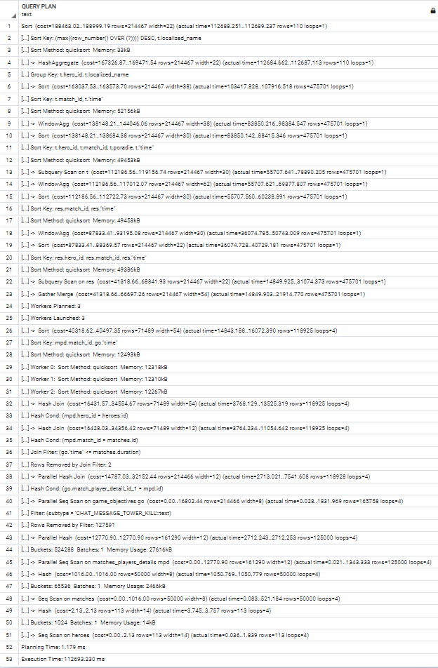

ORM:

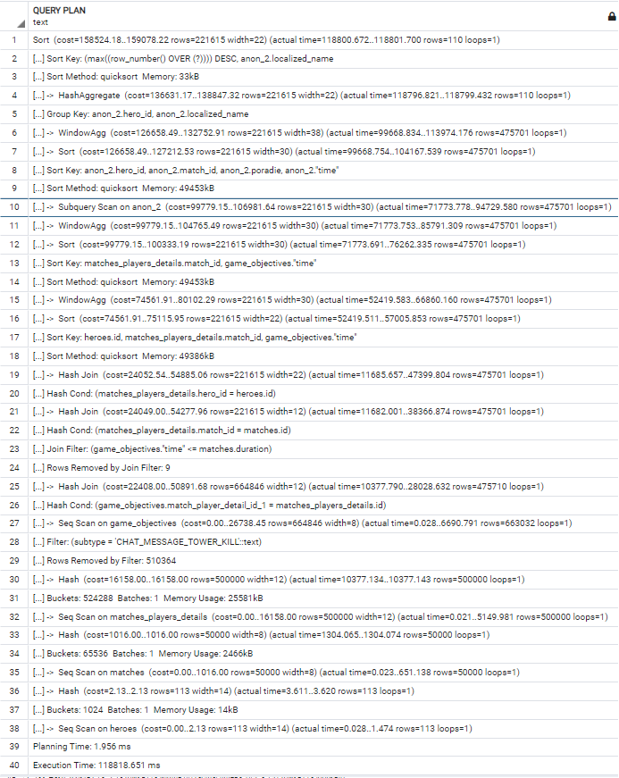
